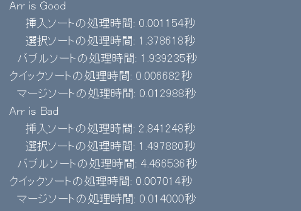

# ソート比較アプリ

## 概要
このアプリケーションは，異なるソートアルゴリズムの処理時間を比較するためのものです．  
ユーザが設定した要素数を最良の場合・最悪の場合に並び替えて，各アルゴリズムの処理時間を観察できます．  
PySimpleGUIライブラリを使用して，使いやすいインタフェースを提供しています．

## 特徴
- ソートアルゴリズムの比較: 
  - 挿入ソート
  - 選択ソート
  - バブルソート
  - クイックソート(ピボットに中央値を使用)
  - マージソート
- インタラクティブなインタフェース: 要素数を入力し，各ソートアルゴリズムの処理時間を表示します．
- リアルタイムのパフォーマンス測定: 各ソートアルゴリズムの処理時間を表示します．

## 使用方法
### 必要環境
- Python: Python 3.11.0がインストールされていることを確認してください．
- ライブラリ:
  - PySimpleGUI: 'pip install PySimpleGUI'
  - time
  - random

### 使用方法
- 要素数を入力する: 入力ボックスに要素数を入力します．  
  
- 実行ボタンを押す: 実行ボタンを押してソートを開始します．  
  
- 結果を確認する: 各ソートアルゴリズムの処理時間が表示されます．  
  

## コードの説明
### メインコード
1. GUIレイアウト: PySimpleGUIを使用してユーザインタフェースを作成します.  
```python
layout = [[sg.T("ソートの処理時間比較")], 
          [sg.T("要素数"), sg.I("100", k = "n")], 
          [sg.B("実行", k = "btn")], 
          [sg.T("Arr is Good")],
          [sg.T(k = "insertion_sort_good")], 
          [sg.T(k = "selection_sort_good")], 
          [sg.T(k = "bubble_sort_good")], 
          [sg.T(k = "quick_sort_good")], 
          [sg.T(k = "merge_sort_good")],
          [sg.T("Arr is Bad")], 
          [sg.T(k = "insertion_sort_bad")], 
          [sg.T(k = "selection_sort_bad")], 
          [sg.T(k = "bubble_sort_bad")], 
          [sg.T(k = "quick_sort_bad")], 
          [sg.T(k = "merge_sort_bad")]]
win = sg.Window("ソート比較アプリ", layout, 
                font = (None, 14), size = (500, 500))
```
2. ソート関数: 各ソートアルゴリズムを定義します．  
```python
def sort():
    n = int(v["n"])    
    
    def insertion_sort(arr):
        n = len(arr)
        for i in range(1, n):
            key = arr[i]
            j = i - 1
            while j >= 0 and arr[j] > key:
                arr[j + 1] = arr[j]
                j -= 1
            arr[j + 1] = key

    def selection_sort(arr):
        n = len(arr)
        for i in range(n):
            min_idx = i
            for j in range(i + 1, n):
                if arr[j] < arr[min_idx]:
                    min_idx = j
            arr[i], arr[min_idx] = arr[min_idx], arr[i]

    def bubble_sort(arr):
        n = len(arr)
        for i in range(n):
            for j in range(n - i - 1):
                if arr[j] > arr[j + 1]:
                    arr[j], arr[j + 1] = arr[j + 1], arr[j]

    def quick_sort_mid(arr, low, high):
        if low < high:
            pi = partition_mid(arr, low, high)
            quick_sort_mid(arr, low, pi)
            quick_sort_mid(arr, pi + 1, high)

    def partition_mid(arr, low, high):
        pivot = arr[(low + high) // 2]
        i = low - 1
        j = high + 1
        while True:
            i += 1
            while arr[i] < pivot:
                i += 1
            j -= 1
            while arr[j] > pivot:
                j -= 1
            if i >= j:
                return j
            arr[i], arr[j] = arr[j], arr[i]

    def merge_sort(arr):
        if len(arr) > 1:
            mid = len(arr) // 2
            L = arr[:mid]
            R = arr[mid:]
            merge_sort(L)
            merge_sort(R)
            i = j = k = 0
            while i < len(L) and j < len(R):
                if L[i] < R[j]:
                    arr[k] = L[i]
                    i += 1
                else:
                    arr[k] = R[j]
                    j += 1
                k += 1
            while i < len(L):
                arr[k] = L[i]
                i += 1
                k += 1
            while j < len(R):
                arr[k] = R[j]
                j += 1
                k += 1
```

3. 処理時間測定: 各ソートアルゴリズムの処理時間を測定する関数です．  
```python
# 挿入ソートの処理時間を計測
insertion_sort_good_time = measure_time(insertion_sort, arr_good[:])
insertion_sort_bad_time = measure_time(insertion_sort, arr_bad[:])

# 選択ソートの処理時間を計測
selection_sort_good_time = measure_time(selection_sort, arr_good[:])
selection_sort_bad_time = measure_time(selection_sort, arr_bad[:])

# バブルソートの処理時間を計測
bubble_sort_good_time = measure_time(bubble_sort, arr_good[:])
bubble_sort_bad_time = measure_time(bubble_sort, arr_bad[:])

# クイックソートの処理時間を計測
quick_sort_good_time = measure_time_quick(quick_sort_mid, arr_good[:])
quick_sort_bad_time = measure_time_quick(quick_sort_mid, arr_bad[:])

# マージソートの処理時間を計測
merge_sort_good_time = measure_time(merge_sort, arr_good[:])
merge_sort_bad_time = measure_time(merge_sort, arr_bad[:])

```
4. アプリケーションロジック: ユーザー入力を処理し，GUIに処理結果を表示する．
```python
insertion_sort_good = f"　挿入ソートの処理時間: {insertion_sort_good_time:.6f}秒"
selection_sort_good = f"　選択ソートの処理時間: {selection_sort_good_time:.6f}秒"
bubble_sort_good = f"バブルソートの処理時間: {bubble_sort_good_time:.6f}秒"
quick_sort_good = f"クイックソートの処理時間: {quick_sort_good_time:.6f}秒"
merge_sort_good = f"　マージソートの処理時間: {merge_sort_good_time:.6f}秒"
insertion_sort_bad = f"　挿入ソートの処理時間: {insertion_sort_bad_time:.6f}秒"
selection_sort_bad = f"　選択ソートの処理時間: {selection_sort_bad_time:.6f}秒"
bubble_sort_bad = f"バブルソートの処理時間: {bubble_sort_bad_time:.6f}秒"
quick_sort_bad = f"クイックソートの処理時間: {quick_sort_bad_time:.6f}秒"
merge_sort_bad = f"　マージソートの処理時間: {merge_sort_bad_time:.6f}秒"
```

## 使用用途
### 教育目的
ソートアルゴリズムの学習者が，異なるアルゴリズムの性能さを視覚的に理解するのに役立ちます．実際にプログラムを動かすことで，たとえなクイックソートとバブルソートのパフォーマンスの違いを直観的に感じることが出来ます．

### 研究・分析
アルゴリズムの研究や性能分析を行う際に，異なる入力ケースに対するアルゴリズムの実行時間を測定し，性能を評価するために使用できます．特に，アルゴリズムの最適化や改良を試みる場合に有効です．

### ソートの選択
異なるハードウェア環境や設定でアルゴリズムの処理速度を比較し，その環境での最適なソートアルゴリズムを選定するのにも役立ちます．
